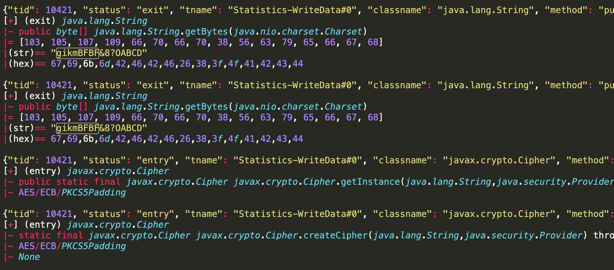
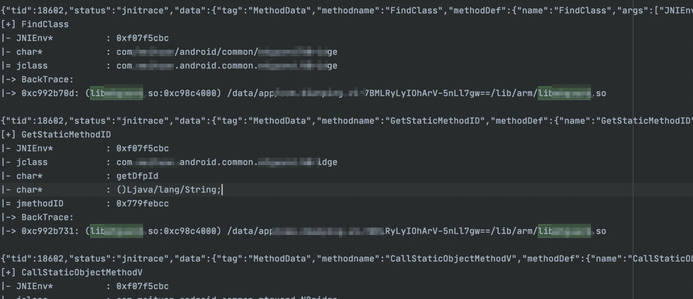

# Android 使用文档

## 一键去常规反调试

```typescript
FCAnd.anti.anti_debug();
```

## trace java methods

在 `index.ts` 中启用下面函数

```typescript
/**
 * java 方法追踪
 * @param clazzes 要追踪类数组 ['M:Base64', 'E:java.lang.String'] ，类前面的 M 代表 match 模糊匹配，E 代表 equal 精确匹配
 * @param whitelist 指定某类方法 Hook 细则，可按白名单或黑名单过滤方法。
 *                  { '类名': {white: true, methods: ['toString', 'getBytes']} }
 * @stackFilter 按匹配字串打印堆栈。如果要匹配 bytes 数组需要十进制无空格字串，例如："104,113,-105"
 */
FCAnd.andOpts.traceArtMethods(
    ['M:MainActivity', 'E:java.lang.String'],
    {'java.lang.String': {white: true, methods:['substring', 'getChars']}},
    "match_str_show_stacks"
);
```

通过 `python/android/traceLogCleaner.py` 脚本收集 trace 日志，可以按线程、格式化输出日志

格式化 trace 效果



## trace jni

本功能是 [jnitrace](https://github.com/chame1eon/jnitrace) 的一个简化和嵌入版。

在 `index.ts` 中启用下面函数

```typescript
FCAnd.jni.traceAllJNISimply();
```

通过 `python/android/traceLogCleaner.py` 脚本收集 trace 日志，可以按线程、格式化输出日志

输出样例：



## 打印堆栈
```typescript
FCAnd.andOpts.showStacks();
```

## 通用的 Dump dex 方法
```typescript
FCAnd.andOpts.dump_dex_common();
```
## load 自定义 ssl 证书

将证书 `cert-der.crt` 传到手机，然后调用下面的语句

```typescript
FCAnd.anti.anti_sslLoadCert("/data/local/tmp/cert-der.crt");
```

## ssl unpinning

相当于 frida 版的 JustTrustMe 

```typescript
FCAnd.anti.anti_ssl_unpinning();
```

## Hook JNI
方便的 JNI Hook
```typescript
FCAnd.jni.hookJNI('NewStringUTF', {
    onEnter: function (args) {
        var str = args[1].readCString();
        DMLog.i('NewStringUTF', 'str: ' + str);
        if (null != str) {
            if (str == 'mesh' || str.startsWith('6962')) {
                var lr =  FCAnd.AndOpts.getLR(this.context);
                DMLog.i('NewStringUTF', '(' + Process.arch + ')lr: ' + lr
                    + ', foundso:' + FCAnd.AndOpts.getModuleByAddr(lr) );
                // FCCommon.getStacksModInfo(this.context, 100);
            }
        }
    }
});
```

## 打印 registNatives

```typescript
FCAnd.jni.hook_registNatives();
```

该功能拆分出了一个独立模块，使用频率高的朋友可以使用独立模块
地址：https://github.com/deathmemory/fridaRegstNtv

## 其它

1. 根据地址获取所在 module 的信息
2. 获取模块地址
3. 获取 LR 寄存器值
4. 现成的 Hook url/json/map ...

